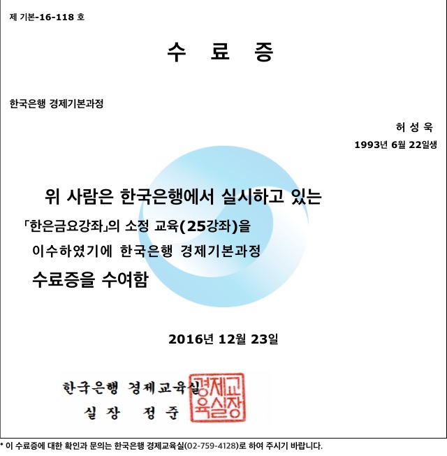
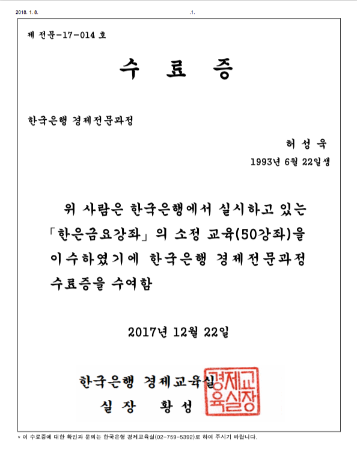

### 소개
- 전공 : 통계학, 금융공학
- 관심분야 : 머신러닝(딥러닝), 수학, 통계, 금융, 철학
- 프로그래밍 언어 : __R, Python, SQL, Shell Script__
- 블로그 : <http://analysts.tistory.com/>
- 이메일 : actto8290@gmail.com
- 코멘트 : 질문사항이나 문의가 있을시 이메일로 보내주시면 감사하겠습니다.

### 수상 및 활동 내역

- 2017.06.26 ~ 2017.09.16 : 빅데이터 청년인재 일자리 연계사업 수료
  - 주최 : 과학기술정보통신부(전 미래창조과학부)
  - 주관 : 한국데이터진흥원
  - __대상 수상__
    - 프로젝트명 : 진우(眞友) - 합리적인 투자 솔루션
    - 머신러닝 알고리즘 기반으로 포트폴리오 추천 시스템 개발
- 2015.11.06 ~ 2016.12.23 : 한국은행 경제기본과정 수료
- 2016.12.24 ~ 2017.12.22 : 한국은행 경제전문과정 수료

                     
- 2017.09 ~ 2017.12 : '기업신용평가' 프로젝트 진행 
- 2017.03 ~ 2017.06 : '프로야구 관객수 예측모형' 프로젝트 진행 (업로드 예정)
- 2017.10.23 ~ing : '가상화폐(코인) 분석' 진행중 (업로드 예정)
  - 분석 목표 : 비슷하게 움직이는(몇 시차를 두고) 가상화폐를 찾는다. 그 후 선행하는 코인에 따라 후행하는 코인을 살지 말지 의사결정을 한다.
  - 완료된 사항
    - _Shell Script, Python_ 을 이용해 쉘을 실행시 자동적으로 [Coinmarketcap](https://coinmarketcap.com/) 에서 시가총액 기준 상위 100개 코인들의 데이터(시가,종가,고가,저가,거래량 등등) 을 크롤링
    - _R_ 을 이용해 Moving Average 7-day 기준으로 시차를 계속 변해가면서 각 코인들간의 Correlation을 분석해 선행하는 코인을 찾는다.
    - BackTesting : 선행하는 코인들 기준으로 후행하는 코인들을 사고 파는 의사결정을 했을 때 평균 수익률이 얼마나 나오는지 알고리즘 완료.
    - 진행중 : BackTesting을 한 시점에서만 하는 게 아니라 Rolling 으로 과거 기준 하루하루마다 평균 수익률을 구해서 알고리즘의 신뢰도 파악.

-------
### Introduction

- Major : Statistics, Financial Engineering
- Interested in : Machine Learning(Deep Learning), Statistics, Math, Finance, Philosophy
- Programming language : __R, Python, SQL, Shell Scrpit__
- Blog : <http://analysts.tistory.com/>
- Email : actto8290@gmail.com
- Comment : Thanks for email me if you have any question.